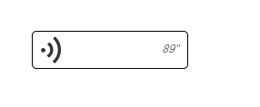

# voice-play-similar-wechat

语音播放，高仿微信，`web` && `h5` 通用。

点击即可播放，喇叭变为 `播放状态`，二次点击，播放停止，喇叭变为 `初始状态`。

[具体演示效果](https://zzugbb.github.io/voice-play-similar-wechat/)

## 说明

1. 具体播放器采用的为 [jplayer](http://www.jplayer.org/).
2. 播放状态变更采用的 `图片替换` (png <==> gif).

## 为什么不用 h5 音频标签 `audio` ?

1. 初始尝试使用 `audio`, 发现无法播放，格式支持有点少，部分编码格式可能无法播放。
2. `jplayer`, 之前在用，相对顺手，且格式支持较好，`web` 或者 `h5` 都能很好支持。

## 为什么不用 CSS 动画，来表示播放状态 ？

因为我懒、、、、

## 关于 *jplayer*

> jPlayer：基于HTML5/Flash的音频、视频播放器

> jPlayer是一个JavaScript写的完全免费和开源 (MIT) 的jQuery多媒体库插件 (现在也是一个Zepto插件) jPlayer可以让你迅速编写一个跨平台的支持音频和视频播放的网页. jPlayer的丰富API可以让你创建一个个性化多媒体应用，因此也获得越来越多的社区成员的支持和鼓励。

* [jplayer官网](http://www.jplayer.org/)
* [jplayer中文网](http://www.jplayer.cn/)
